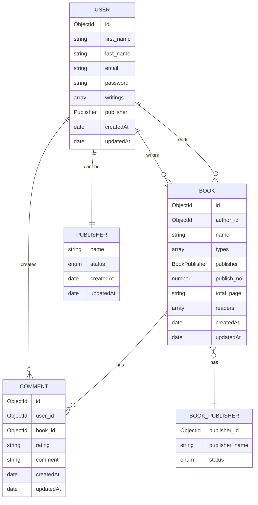

# Book Publisher API

A comprehensive RESTful API built for a book publishing platform, featuring user roles (readers, authors, publishers), book management, and review systems. Built with Node.js and Express.js, following object-oriented principles and clean architecture practices.

## 📋 Table of Contents
- [Features](#-features)
- [Database Schema Documentation](#database-schema-documentation)
  - [Database Schema Diagram](#-database-schema-diagram)
  - [Schema Details](#schema-details)
    - [Collections](#collections)
    - [Publisher Status Enumeration](#publisher-status-enumeration)
    - [Key Relationships](#key-relationships)
    - [Indexes](#indexes)
    - [Data Model Features](#data-model-features)
    - [Notes](#notes)
- [Tech Stack](#-tech-stack)
- [API Endpoints](#-api-endpoints)
  - [Authentication & Users](#authentication--users)
  - [Books](#books)
  - [Publishers](#publishers)
  - [Comments](#comments)
- [Setup & Installation](#-setup--installation)
- [Middleware Structure](#-middleware-structure)
- [Validation](#-validation)
- [Contributing](#-contributing)
- [License](#-license)

## 📚 Features

- **User Management**
  - Role-based authentication (Readers, Authors, Publishers, Admin)
  - JWT-based authentication
  - Password change functionality
  - Profile management

- **Book Management**
  - Create, read, update, and delete books
  - Book status management (Draft, Published, etc.)
  - Search books by name
  - Pagination support
  - Reader tracking system

- **Publisher Features**
  - Publisher approval system
  - Publisher-specific book listings
  - Status management for publications

- **Comment System**
  - Book review and rating system
  - Comment management features
  - User-specific comment history

# Database Schema Documentation

## 📊 Database Schema Diagram


## Schema Details

### Collections

#### User Collection
- Stores user information including personal details and relationships with books
- Contains publisher information if the user is also a publisher
- Tracks both written and read books

#### Book Collection
- Stores book information including metadata and relationships
- Tracks readers and author information
- Contains embedded publisher information

#### Comment Collection
- Stores user reviews and ratings for books
- Links users with their book reviews

### Publisher Status Enumeration
The following status values are available for publishers:
- `pending`: Awaiting approval
- `approved`: Active publisher
- `rejected`: Publisher application denied
- `suspended`: Temporarily suspended publisher

### Key Relationships

1. **User - Publisher Relationship**
   - Each user can optionally be associated with a publisher (publisher sub-schema)
   - Publisher status is tracked through the status enum

2. **User - Book Relationships**
   - Authors: Users can write multiple books (tracked in writings array)
   - Readers: Users can read multiple books (tracked in readers array)
   - Bi-directional relationship allows for easy querying of both authored and read books

3. **Book - BookPublisher Relationship**
   - Each book has associated publisher information
   - Implemented as an embedded document for efficient querying

4. **Book - Comment Relationship**
   - Books can have multiple comments/reviews
   - Enables tracking of book ratings and user feedback

5. **User - Comment Relationship**
   - Users can create multiple comments
   - Facilitates user review history tracking

### Indexes
The following indexes are implemented for optimal query performance:
- `publisher` field in the User collection
- `publisher` field in the Book collection

### Data Model Features
- Timestamp tracking (`createdAt`, `updatedAt`) for all major collections
- Use of MongoDB ObjectIds for document relationships
- Embedded documents for frequently accessed related data
- Array fields for many-to-many relationships

### Notes
- All timestamps are stored in UTC
- Book types are stored as an array to support multiple genres/categories
- Publisher status changes are tracked with timestamps

## 🛠 Tech Stack

- **Core**
  - Node.js
  - Express.js (^4.21.1)
  - MongoDB with Mongoose (^8.8.0)
  - JWT for authentication (^9.0.2)

- **Validation & Security**
  - Joi for validation (^17.13.3)
  - Bcrypt for password hashing (^5.1.1)
  - Helmet for security headers (^8.0.0)
  - CORS support (^2.8.5)

- **Code Quality & Utils**
  - ESLint for linting (^9.14.0)
  - Prettier for formatting (^3.3.3)
  - Winston for logging (^3.16.0)
  - Module aliases for clean imports
  - HTTP-Status for standard status codes

- **Development & Deployment**
  - PM2 for process management (^5.4.2)
  - Compression middleware
  - Environment variable support (dotenv)

## 🚀 API Endpoints

### Authentication & Users
```
POST   /users/login           - User login
POST   /users                 - User registration
PATCH  /users                 - Update user profile
POST   /users/change-password - Change password
GET    /users/:id            - Get user details
DELETE /users/:id            - Delete user
```

### Books
```
GET    /books                 - Get published books (with pagination)
GET    /books/search         - Search books by name
GET    /books/profile        - Get author's books
GET    /books/author/:id     - Get published books by author
GET    /books/publisher      - Get publisher's books
GET    /books/publisher/:id  - Get published books by publisher
GET    /books/:id           - Get specific book
POST   /books                - Create new book
PATCH  /books/:id           - Update book
PATCH  /books/status/:id    - Update book status
PATCH  /books/reader/:id    - Add reader to book
DELETE /books/:id           - Delete book
```

### Publishers
```
GET    /publishers           - Get approved publishers
GET    /publishers/:id      - Get specific publisher
POST   /publishers          - Create publisher
PATCH  /publishers/:id      - Update publisher
PATCH  /publishers/status/:id - Update publisher status
DELETE /publishers/:id      - Delete publisher
```

### Comments
```
GET    /comments/:id        - Get specific comment
GET    /comments/book/:id   - Get book comments
POST   /comments           - Create comment
PATCH  /comments/:id       - Update comment
DELETE /comments/:id       - Delete comment
```

## 🛠 Setup & Installation

1. Clone the repository:
```bash
git clone https://github.com/yourusername/book-publisher-api.git
cd book-publisher-api
```

2. Install dependencies:
```bash
npm install
```

3. Set up environment variables:
```bash
cp .env.example .env
```

Required environment variables:
```
PORT=8000
MONGODB_URI=mongodb://localhost:27017/book-publisher
JWT_SECRET=your-secret-key
```

4. Start the development server:
```bash
npm start
```

Or with PM2:
```bash
pm2 start app.js
```

## 🔒 Middleware Structure

The API uses several middleware layers for security and validation:

- **authenticate**: Verifies JWT tokens and user sessions
- **isAdmin**: Checks for administrative privileges
- **validate**: Validates request body using Joi schemas
- **validateParams**: Validates URL parameters
- **error handling**: Global error handling middleware

## 🧪 Validation

Request validation is handled using Joi schemas for:
- User registration and updates
- Book creation and modifications
- Publisher management
- Comment submissions

Example validation schema:
```javascript
const createValidation = Joi.object({
  email: Joi.string().required().email(),
  password: Joi.string().required().min(8),
  firstName: Joi.string().required().min(2),
  lastName: Joi.string().required().min(2)
});
```

## 👥 Contributing

1. Fork the repository
2. Create your feature branch (`git checkout -b feature/amazing-feature`)
3. Commit your changes (`git commit -m 'Add some amazing feature'`)
4. Push to the branch (`git push origin feature/amazing-feature`)
5. Open a Pull Request

## 📄 License

This project is licensed under the MIT License - see the [LICENSE](LICENSE) file for details.
