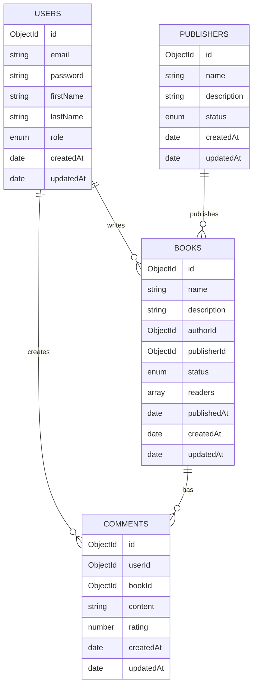

# Book Publisher API

A comprehensive RESTful API built for a book publishing platform, featuring user roles (readers, authors, publishers), book management, and review systems. Built with Node.js and Express.js, following object-oriented principles and clean architecture practices.

## 📚 Features

- **User Management**
  - Role-based authentication (Readers, Authors, Publishers, Admin)
  - JWT-based authentication
  - Password change functionality
  - Profile management

- **Book Management**
  - Create, read, update, and delete books
  - Book status management (Draft, Published, etc.)
  - Search books by name
  - Pagination support
  - Reader tracking system

- **Publisher Features**
  - Publisher approval system
  - Publisher-specific book listings
  - Status management for publications

- **Comment System**
  - Book review and rating system
  - Comment management features
  - User-specific comment history

## 📊 Database Schema



## 🛠 Tech Stack

- **Core**
  - Node.js
  - Express.js (^4.21.1)
  - MongoDB with Mongoose (^8.8.0)
  - JWT for authentication (^9.0.2)

- **Validation & Security**
  - Joi for validation (^17.13.3)
  - Bcrypt for password hashing (^5.1.1)
  - Helmet for security headers (^8.0.0)
  - CORS support (^2.8.5)

- **Code Quality & Utils**
  - ESLint for linting (^9.14.0)
  - Prettier for formatting (^3.3.3)
  - Winston for logging (^3.16.0)
  - Module aliases for clean imports
  - HTTP-Status for standard status codes

- **Development & Deployment**
  - PM2 for process management (^5.4.2)
  - Compression middleware
  - Environment variable support (dotenv)

## 🚀 API Endpoints

### Authentication & Users
```
POST   /users/login           - User login
POST   /users                 - User registration
PATCH  /users                 - Update user profile
POST   /users/change-password - Change password
GET    /users/:id            - Get user details
DELETE /users/:id            - Delete user
```

### Books
```
GET    /books                 - Get published books (with pagination)
GET    /books/search         - Search books by name
GET    /books/profile        - Get author's books
GET    /books/author/:id     - Get published books by author
GET    /books/publisher      - Get publisher's books
GET    /books/publisher/:id  - Get published books by publisher
GET    /books/:id           - Get specific book
POST   /books                - Create new book
PATCH  /books/:id           - Update book
PATCH  /books/status/:id    - Update book status
PATCH  /books/reader/:id    - Add reader to book
DELETE /books/:id           - Delete book
```

### Publishers
```
GET    /publishers           - Get approved publishers
GET    /publishers/:id      - Get specific publisher
POST   /publishers          - Create publisher
PATCH  /publishers/:id      - Update publisher
PATCH  /publishers/status/:id - Update publisher status
DELETE /publishers/:id      - Delete publisher
```

### Comments
```
GET    /comments/:id        - Get specific comment
GET    /comments/book/:id   - Get book comments
POST   /comments           - Create comment
PATCH  /comments/:id       - Update comment
DELETE /comments/:id       - Delete comment
```

## 🛠 Setup & Installation

1. Clone the repository:
```bash
git clone https://github.com/yourusername/book-publisher-api.git
cd book-publisher-api
```

2. Install dependencies:
```bash
npm install
```

3. Set up environment variables:
```bash
cp .env.example .env
```

Required environment variables:
```
PORT=8000
MONGODB_URI=mongodb://localhost:27017/book-publisher
JWT_SECRET=your-secret-key
```

4. Start the development server:
```bash
npm start
```

Or with PM2:
```bash
pm2 start app.js
```

## 🔒 Middleware Structure

The API uses several middleware layers for security and validation:

- **authenticate**: Verifies JWT tokens and user sessions
- **isAdmin**: Checks for administrative privileges
- **validate**: Validates request body using Joi schemas
- **validateParams**: Validates URL parameters
- **error handling**: Global error handling middleware

## 🧪 Validation

Request validation is handled using Joi schemas for:
- User registration and updates
- Book creation and modifications
- Publisher management
- Comment submissions

Example validation schema:
```javascript
const createValidation = Joi.object({
  email: Joi.string().required().email(),
  password: Joi.string().required().min(8),
  firstName: Joi.string().required().min(2),
  lastName: Joi.string().required().min(2)
});
```

## 👥 Contributing

1. Fork the repository
2. Create your feature branch (`git checkout -b feature/amazing-feature`)
3. Commit your changes (`git commit -m 'Add some amazing feature'`)
4. Push to the branch (`git push origin feature/amazing-feature`)
5. Open a Pull Request

## 📄 License

This project is licensed under the MIT License - see the [LICENSE](LICENSE) file for details.
